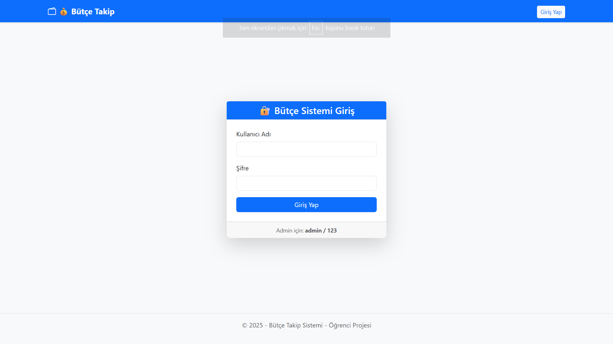
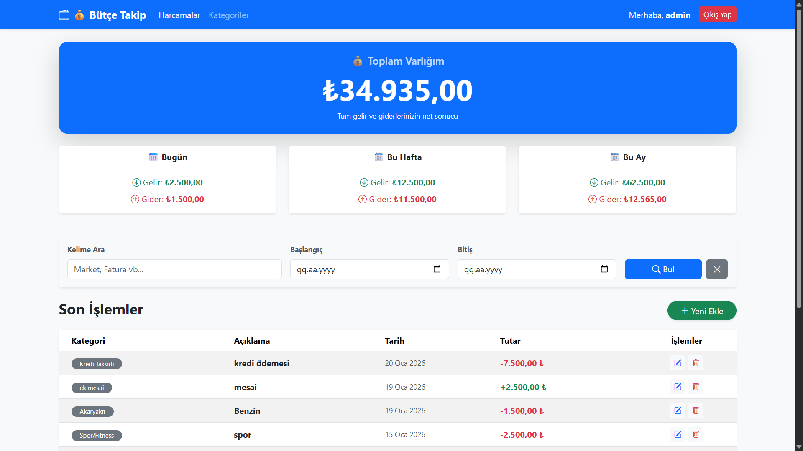
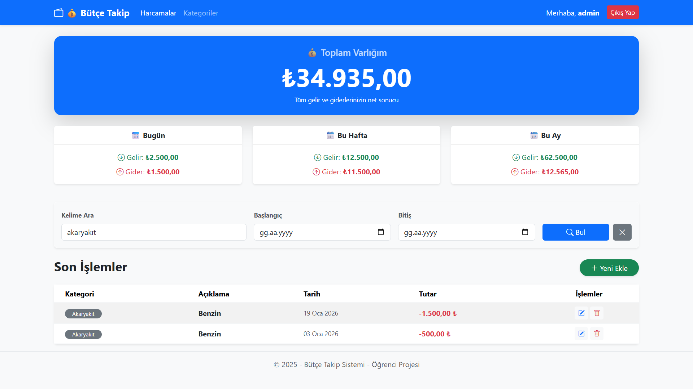
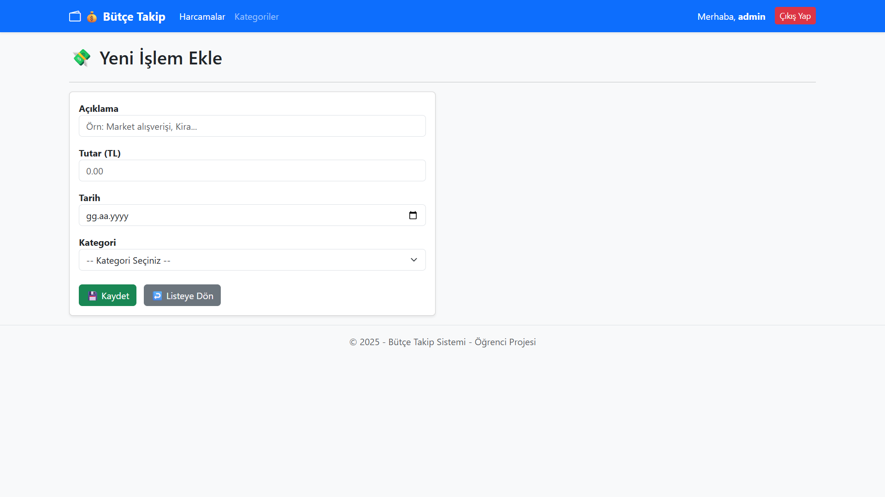
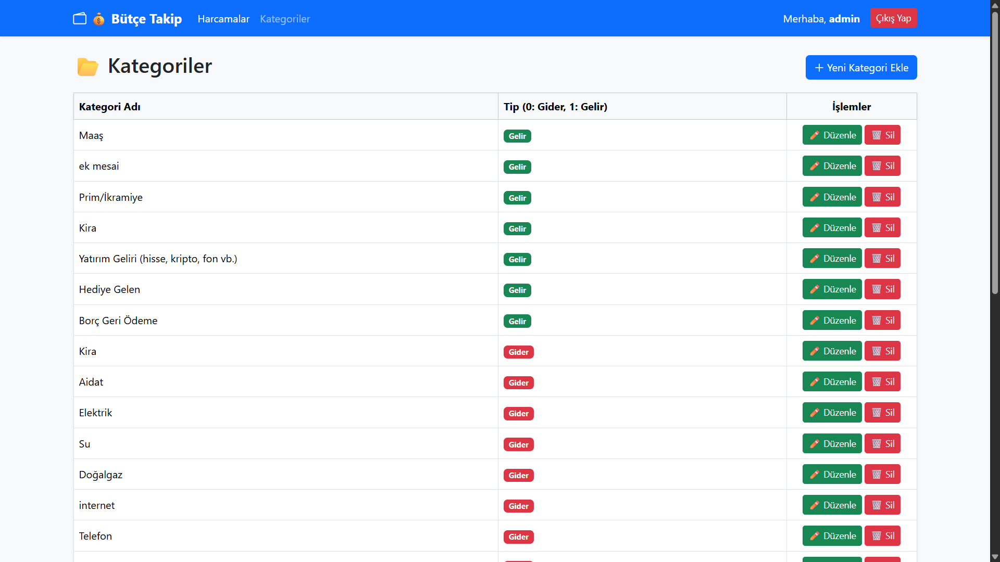

# 💸 Bütçe Takip Sistemi (Budget Tracker)

Bu proje, kişisel gelir ve giderlerinizi takip etmenizi sağlayan, anlık bakiye hesaplaması yapan ve harcamaları kategorize eden bir web uygulamasıdır. Kullanıcı dostu arayüzü sayesinde finansal durumunuzu kolayca analiz edebilirsiniz.

## 🚀 Özellikler

- **🔐 Güvenli Giriş:** Kullanıcı kimlik doğrulama sistemi.
- **📊 Dashboard (Genel Bakış):** Anlık toplam bakiye, günlük/haftalık/aylık gelir-gider özeti.
- **📂 Kategori Yönetimi:** Gelir ve Gider kalemleri için özel kategoriler oluşturma.
- **➕ İşlem Takibi:** Kolayca harcama veya gelir ekleme/düzenleme.
- **🔍 Filtreleme:** Tarih aralığına, kategoriye veya kelimeye göre detaylı arama.
- **📈 İstatistikler:** Harcama alışkanlıklarını analiz eden dinamik hesaplamalar.

## 📷 Ekran Görüntüleri

Projenin çalışan halinden görünümler:

### 1. Giriş Ekranı
Güvenli ve şık kullanıcı giriş sayfası.

### 2. Dashboard (Genel Bakış)
Tüm varlıklarınızı ve özet durumunuzu tek bakışta görün.

### 3. Arama ve Filtreleme
Geçmiş harcamalarınızı tarih veya kelime bazlı filtreleyerek bulun.

### 4. Yeni İşlem Ekleme
Hızlı ve kolay veri girişi formu.

### 5. Kategoriler
Gelir ve gider türlerinizi özelleştirin.

---

## 🛠️ Kullanılan Teknolojiler

- **Backend:** ASP.NET Core 8.0 MVC
- **Veritabanı:** Entity Framework Core (Code First) & SQL Server
- **Frontend:** HTML5, CSS3, Bootstrap 5
- **IDE:** Visual Studio 2022

## 📦 Kurulum ve Çalıştırma

1. Projeyi bilgisayarınıza indirin (Clone veya Download Zip).
2. `appsettings.json` dosyasındaki veritabanı bağlantı yolunu (Connection String) kendi sunucunuza göre ayarlayın.
3. Package Manager Console üzerinden `Update-Database` komutunu çalıştırarak veritabanını oluşturun.
4. Projeyi çalıştırın. (Seed Data özelliği sayesinde örnek kategoriler otomatik yüklenecektir).

---
Geliştirici: **[Ali Rıza Demir]**
